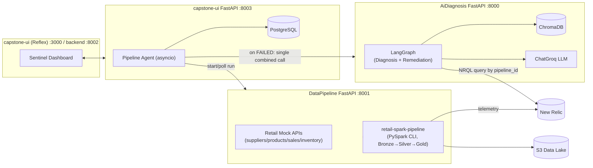
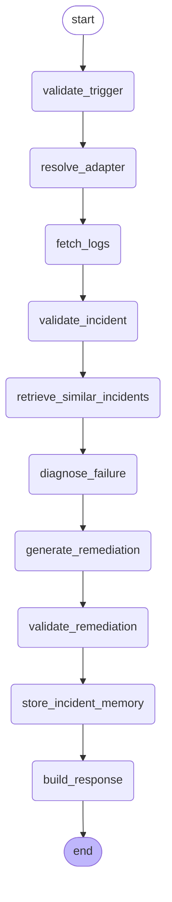
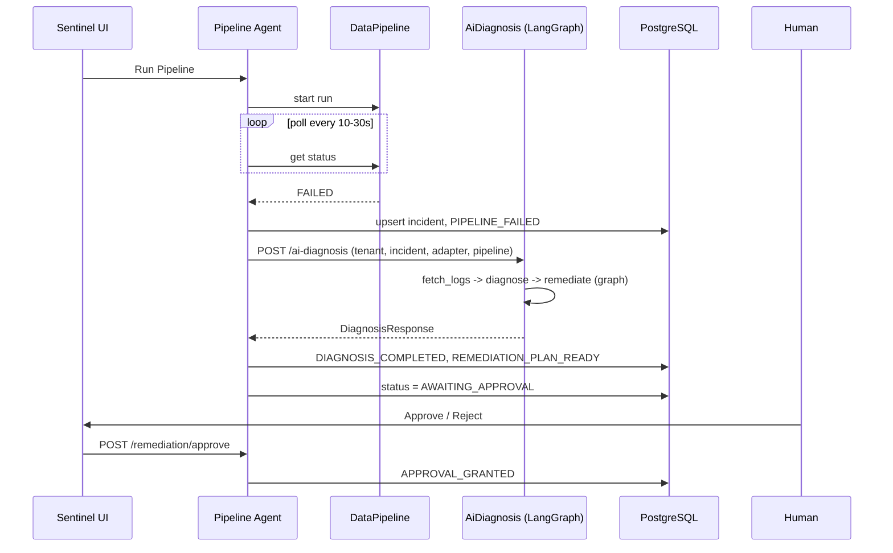

# Presentation Content: Sentinel — Autonomous Data Pipeline Incident Management

Grounded in the actual repo (verified against the code) — nothing invented. Organized as ready-to-paste slides.

---

## Slide 1 — Title
**Sentinel: Autonomous Data Pipeline Incident Management**
*Multi-agent system for detection, diagnosis, remediation planning, and human-gated recovery of data pipeline failures*
Subtitle: FastAPI · LangGraph · LangChain (Groq) · ChromaDB · Reflex · PostgreSQL

## Slide 2 — Agenda
1. Problem & motivation
2. System architecture (3 services)
3. The 3 agents
4. LangGraph deep dive (Diagnosis + Remediation)
5. Data model & human approval gate
6. Multi-tenancy & adapter pattern
7. Observability (LangSmith)
8. Engineering challenges & lessons learned
9. Demo
10. Roadmap

## Slide 3 — Problem Statement
- Retail data pipelines (Bronze→Silver→Gold) fail silently or require manual triage.
- Engineers manually: check logs → guess root cause → decide a fix → execute.
- Goal: automate detection → root-cause diagnosis → remediation planning, **while keeping a human in the loop** before anything executes.

## Slide 4 — Solution Overview
Three independent services, three agents:

| # | Agent | Where it lives | What it does |
|---|---|---|---|
| 1 | **Pipeline Agent** | `capstone-ui` (asyncio orchestrator) | Starts/polls pipeline runs, detects failure |
| 2 | **Diagnosis/RCA Agent** | `AiDiagnosis` (LangGraph node group) | Root-cause analysis via LLM + evidence |
| 3 | **Remediation/Planning Agent** | `AiDiagnosis` (LangGraph node group) | Proposes validated fix actions |

A human then **approves or rejects** the plan — nothing auto-executes today.

## Slide 5 — High-Level Architecture

## Slide 6 — Tech Stack by Service
- **AiDiagnosis**: FastAPI, LangGraph, LangChain + `langchain-groq` (model `openai/gpt-oss-20b`), ChromaDB (local persistent vector store), New Relic NerdGraph (log retrieval)
- **DataPipeline**: FastAPI (mock retail source APIs), PySpark (`retail-spark-pipeline`), AWS S3 (data lake), New Relic OTLP telemetry
- **capstone-ui**: Reflex (frontend+backend), separate FastAPI backend, PostgreSQL/SQLAlchemy, httpx (service-to-service calls)

## Slide 7 — DataPipeline: The Source System
- Simulates a multi-tenant retail ecosystem: Supplier API, Product catalog, Sales/Orders, Inventory, Promotions — all in-memory, seeded.
- 3 tenants: `tenant_001` (RetailMart India), `tenant_002` (SuperStore India), `tenant_003` (QuickBuy India).
- `retail-spark-pipeline`: real PySpark job implementing the **Medallion architecture**:
  `FastAPI sources → Bronze (raw) → Silver (cleaned/validated) → Gold (business-ready) → S3`
- Emits structured telemetry to New Relic per stage (tagged with a fixed `PIPELINE_ID=retail_data_pipeline`), which is exactly what the Diagnosis Agent later queries.
- `tenant_002` is seeded with a deterministic ~20% invalid-record rate so Silver-stage data-quality failures are reproducible for demos.

## Slide 8 — Agent 1: The Pipeline Agent
- Lives in `capstone-ui/app/agents/pipeline_agent.py` — **plain asyncio background tasks**, not LangGraph.
- Flow: `start_workflow()` → calls DataPipeline to launch a run → polls status every N seconds (backoff on errors) → on `FAILED`/timeout, creates a deterministic incident (`INC-xxxxxxxx`) and hands off to Agent 2/3.
- State persisted every tick to PostgreSQL (`workflow_runs`, `agent_events`) so a process restart resumes in-flight runs (`reconcile_on_startup()`).

## Slide 9 — Agents 2+3: The LangGraph (AiDiagnosis)
Compiled with `StateGraph(AgentState)` in `app/graph/workflow.py`:

- **Diagnosis/RCA Agent** = `fetch_logs → validate_incident → retrieve_similar_incidents → diagnose_failure`
- **Remediation/Planning Agent** = `generate_remediation → validate_remediation`
- Exposed as **one** endpoint: `POST /api/v1/incidents/ai-diagnosis` — the Pipeline Agent calls it once; capstone-ui splits the single response into two sequential audit events (`DIAGNOSIS_COMPLETED`, `REMEDIATION_PLAN_READY`).

## Slide 10 — Inside the Graph: What Each Node Actually Does
- `validate_trigger` — structural checks, builds the `Incident` from the minimal trigger
- `resolve_adapter` — picks Spark or Synapse adapter (strategy pattern)
- `fetch_logs` — queries **New Relic NerdGraph** (NRQL, filtered by `pipeline_id`) for real log lines/error message
- `validate_incident` — fails fast (400) if New Relic returned no evidence
- `retrieve_similar_incidents` — **RAG step**: tenant-scoped cosine-similarity search in ChromaDB (top-k configurable)
- `diagnose_failure` — **LLM call** (`ChatGroq`, structured output → `Diagnosis` model: root cause, confidence, evidence)
- `generate_remediation` — **LLM call** constrained to the adapter's allow-listed actions only
- `validate_remediation` — deterministic guardrail: rejects any action outside the allow-list; downgrades confidence if no evidence
- `store_incident_memory` — upserts into Chroma for future RAG
- `build_response` — assembles the final `DiagnosisResponse` for the UI

## Slide 11 — Multi-Tenancy & Adapter Pattern
- Every incident is strictly scoped by `tenant_id` end-to-end (DataPipeline, AiDiagnosis Chroma queries, Postgres rows) — no cross-tenant leakage.
- **Adapter pattern** (`PipelineAdapter` interface) proves the graph is pipeline-technology-agnostic:
  - `SparkAdapter` — fully implemented, 11 known failure patterns (OOM, data skew, shuffle failures, schema mismatch, connection failures...), 11 allow-listed remediation actions.
  - `SynapseAdapter` — intentionally minimal prototype (2 patterns, 3 actions) to prove the **same graph, same nodes, zero changes** work for a second technology.

## Slide 12 — Data Model (PostgreSQL, capstone-ui)
6 tables (`app/models_db.py`): `IncidentDB`, `IncidentPayloadDB`, `WorkflowRunDB`, `AgentEventDB`, `DiagnosisDB`, `RemediationPlanDB`
- `WorkflowRunDB` tracks poll state/attempts/deadlines per pipeline run.
- `AgentEventDB` is the audit trail (`PipelineAgent: PIPELINE_FAILED`, `DiagnosisAgent: DIAGNOSIS_COMPLETED`, `RemediationAgent: REMEDIATION_PLAN_READY`, `Human: APPROVAL_GRANTED/REJECTED`).
- `RemediationPlanDB.approval_status`: `PENDING → APPROVED | REJECTED`.

## Slide 13 — Human-in-the-Loop Approval Gate
- Backend: `POST /api/v1/incidents/{incident_id}/remediation/approve|reject` — the **single** gate in the whole system.
- **Nothing executes automatically**, by design — approval only records a decision; there is currently no execution agent.
- UI: Sentinel dashboard's Pipeline Run history panel shows the proposed plan (root cause, logs, remedies) with **Approve & Execute / Reject** buttons directly against this endpoint.

## Slide 14 — End-to-End Incident Lifecycle

## Slide 15 — Observability: LangSmith
- Added `LANGSMITH_TRACING` / `LANGSMITH_API_KEY` / `LANGSMITH_PROJECT` as **env-only** config (no keys in source), gitignored `.env`.
- `langsmith` SDK is already a transitive dependency of `langchain-core` — once enabled, LangGraph/LangChain auto-traces every node + every LLM call (prompt, output, token usage, latency) **with zero code changes**.
- Status at time of writing: integration wired and verified end-to-end except for an account-side `403 Forbidden` on trace ingestion (API key/workspace permission issue) — isolated with a direct probe script, confirmed not a code/config bug.
- Correlation design: tag every span with `incident_id`/`tenant_id` metadata so a single incident's full trace (Pipeline Agent → LangGraph → LLM → tools) is filterable as one unit.

## Slide 16 — Engineering Challenges & Lessons Learned
- **Windows + PySpark**: required explicit `JAVA_HOME`/`HADOOP_HOME` propagation into the uvicorn process per-terminal-session (stale shells don't inherit newly-set user env vars).
- **asyncio + FastAPI**: `asyncio.create_task` from a sync route silently fails (no event loop in the threadpool) — routes that schedule background agents must be `async def`.
- **SQLAlchemy + asyncio**: returning a live ORM row across a closed session raises `DetachedInstanceError` — fixed with a frozen snapshot dataclass pattern.
- **Config shadowing**: `AiDiagnosis` has its own `.env` that shadows the repo-root `.env` during upward search — easy to silently miss new shared env vars.
- **Critical bug found & fixed**: diagnosis/remediation was never actually triggering on real failures due to `asyncio.create_task` being called from inside a `to_thread`-executed function (no running loop) — silently swallowed by an outer try/except.

## Slide 17 — Demo Flow (suggested)
1. Show Sentinel dashboard → Run Pipeline for a tenant known to fail (`tenant_002`).
2. Show poll status ticking, then `FAILED`.
3. Expand the resulting incident → show RCA root cause + evidence + remedies.
4. Click **Approve & Execute** → show `approval_status: APPROVED` via API.
5. (If LangSmith key fixed) show the live trace tree for that exact incident.

## Slide 18 — Roadmap / Future Work
- Execution Agent: actually carry out an approved remediation action (currently approval is a no-op beyond recording the decision).
- Resolve LangSmith account/workspace permission issue; wire `@traceable` around non-LangChain tool calls (New Relic fetch, Chroma) for full span coverage.
- Wire Approve/Reject into the legacy incident-detail page too (currently only on the Sentinel dashboard history view).
- Expand Synapse adapter from prototype to full parity with Spark.

## Slide 19 — Q&A
