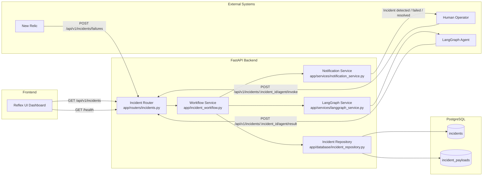
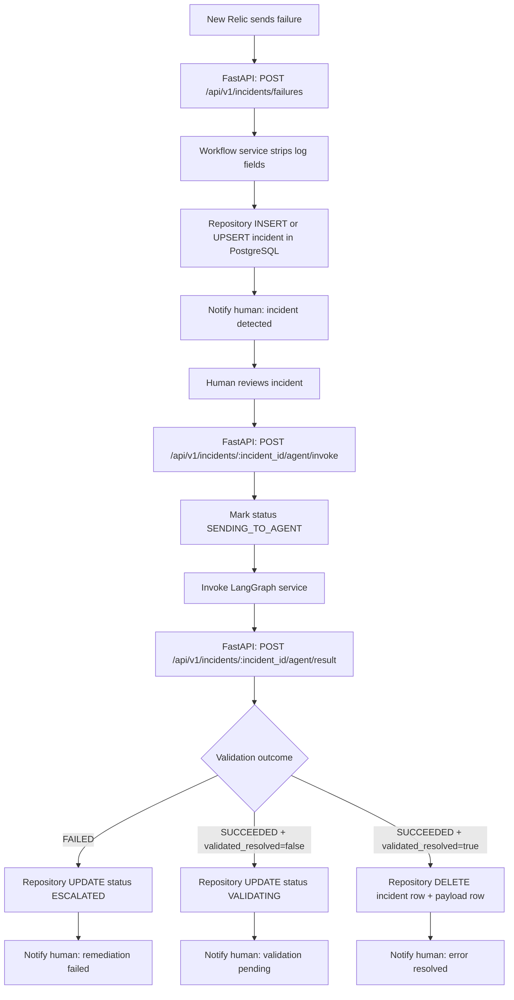

# Architecture and Flow Diagram

## Current Architecture (Implemented)

## Incident Workflow (Implemented)

## Endpoint Surface (Kept)

- GET /health
- POST /api/v1/incidents/failures
- GET /api/v1/incidents
- POST /api/v1/incidents/{incident_id}/agent/invoke
- POST /api/v1/incidents/{incident_id}/agent/result

## Service Layer and Responsibilities

- Router layer: accepts API requests and returns standardized response envelope.
- Workflow service: orchestrates business flow and status transitions.
- Repository layer: performs all PostgreSQL operations with SQLAlchemy ORM.
- Notification service: emits human-facing status notifications.
- LangGraph service: triggers the external remediation agent.
